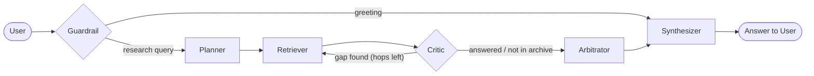

# Hermes by TheKade

Hermes is a research assistant for the Ashen Era Archive. It answers a question
by planning a search, retrieving evidence with hybrid vector and keyword search,
weighing each source against a fixed authority hierarchy, and streaming back a
cited answer.

Every answer carries the sources it was built from, the trust level of each
source, the steps the agent took, and an explicit note when two sources
disagree rather than a silently chosen winner.

## How it works

A question runs through a LangGraph pipeline with conditional routing:



| Node | Responsibility |
|---|---|
| Guardrail | Regex intent check; greetings skip retrieval entirely |
| Planner | Decomposes multi-hop queries, resolves dialogue history, and generates targeted hybrid queries |
| Retriever | Hybrid pgvector and full-text search fused with RRF, cross-encoder rerank, Redis cache |
| Critic | Judges whether the evidence answers the question, whether another search would help, or whether the archive simply lacks it |
| Arbitrator | Sorts evidence by authority and detects factual contradictions |
| Synthesizer | Streams a sourced Markdown answer over SSE |

The retriever and critic form a search loop: the agent reads what it found,
decides what is still missing, and searches again, up to `MAX_SEARCH_HOPS`. It
stops early when the archive plainly does not hold the fact, rather than
spending hops on a search that cannot succeed. When it stops with a gap still
open, the answer says so rather than guessing. Model calls per question are capped by design — see the budget table
in [docs/architecture.md](docs/architecture.md#6-model-call-budget).

## Quick start

Prerequisites: Python 3.11+, Node.js 20+, Docker.

```bash
cp configuration-example/.env.example .env   # fill in VOYAGE_API_KEY and a Gemini credential
make db                                      # PostgreSQL + Redis
make setup                                   # backend and frontend dependencies
make ingest                                  # one-time corpus ingestion
make backend                                 # http://localhost:8000
make frontend                                # http://localhost:3000, separate terminal
```

Open `http://localhost:3000/chat`. The app redirects to `/chat/<sessionId>`
once a session is created. The API serves Swagger UI at
`http://localhost:8000/docs`.

Step-by-step instructions and troubleshooting: [docs/setup.md](docs/setup.md).

## Documentation

| Document | Contents |
|---|---|
| [docs/architecture.md](docs/architecture.md) | System design, agent pipeline, retrieval, data model |
| [docs/api.md](docs/api.md) | HTTP and SSE reference, plus the Swagger and OpenAPI links |
| [docs/setup.md](docs/setup.md) | Local install, ingestion, running, troubleshooting |
| [docs/configuration.md](docs/configuration.md) | Every environment variable and its default |
| [docs/submission_report.md](docs/submission_report.md) | Final competition submission report (5-page structure) |
| [AGENTS.md](AGENTS.md) | Engineering conventions for this repository |
| [ai_usage/ai-usage-disclosure.md](ai_usage/ai-usage-disclosure.md) | AI models, development tools, and governance disclosure |

## Repository layout

```
src/backend/          FastAPI service
  agents/             LangGraph nodes, graph, prompts, sessions
  core/               Config, database, Redis, rate limiting, logging
  ingestion/          Parsing, chunking, embedding
  retrieval/          Vector store, reranker, search API
  workers/            Offline ingestion and query CLIs
src/frontend/         Next.js App Router UI
  app/                Routes (/, /chat, /chat/[sessionId])
  components/         Chat shell, panel, sidebar, answer card, modals
  lib/                API client, constants, validation
configuration-example/  .env template
data/                 Source corpus and extracted assets (gitignored)
docs/                 Project documentation
scripts/              Standalone preprocessing utilities
docker-compose.yml    PostgreSQL, Redis, backend, frontend
Makefile              Development commands
```

## Common commands

```bash
make help          # list every target
make db            # start PostgreSQL and Redis
make backend       # run the API with reload
make frontend      # run the Next.js dev server
make ingest        # ingest the whole raw archive
make health        # check the API health endpoint
make ask Q="..."   # run one query from the CLI
make docker-up     # run the whole stack in Docker
```

## Tech stack

FastAPI, LangGraph, PostgreSQL with pgvector, Redis, Voyage AI embeddings and
reranking, Google Gemini, Next.js, Tailwind CSS.
