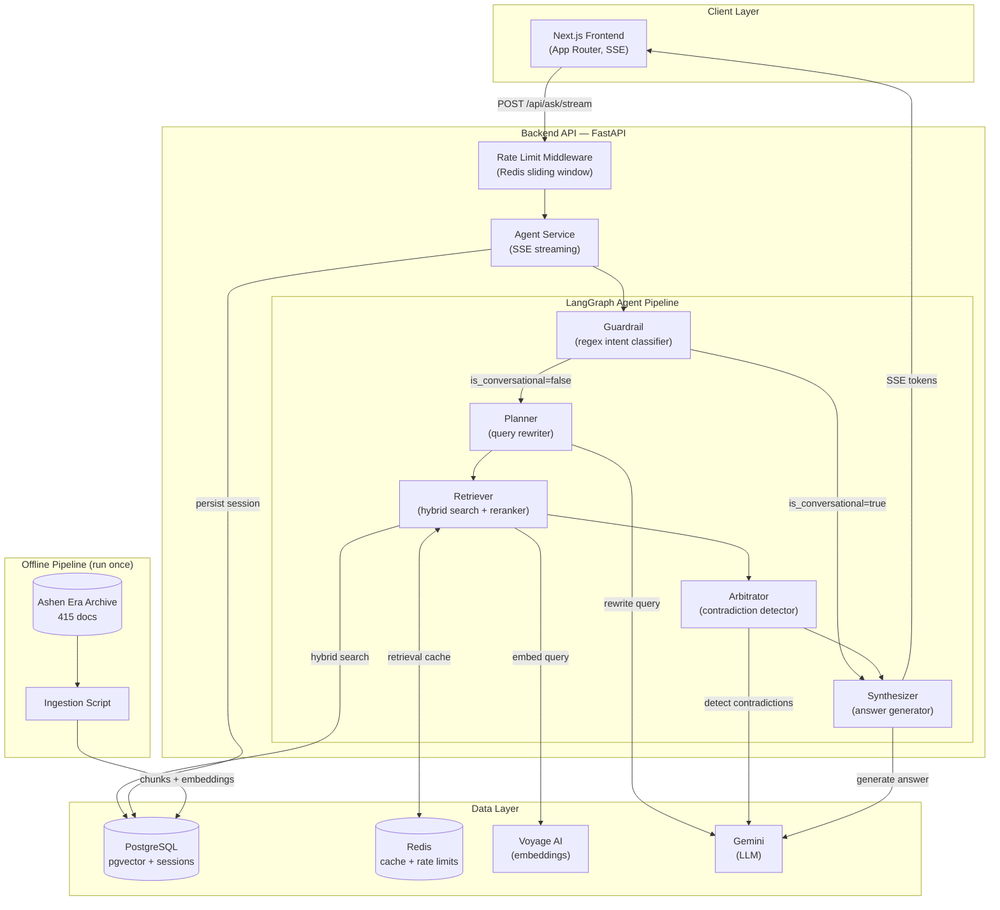
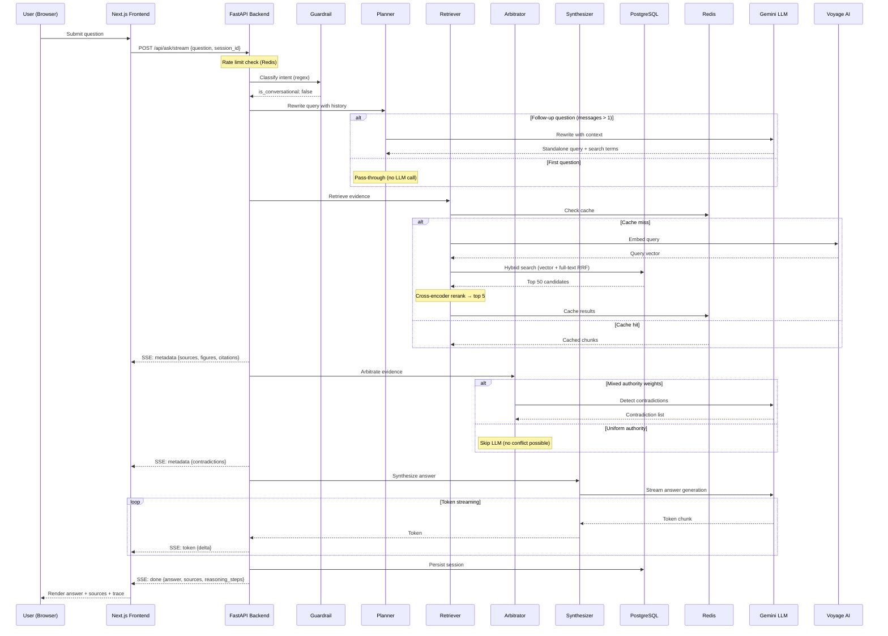

# Technical Architecture — The Archivist (Hermes)

**Sub-track:** 1C — Searching the Way a Human Does (primary)
**Also addresses:** 1B — Connecting Facts Across Thousands of Pages (secondary)

---

## 1. Overview

The Archivist answers questions over the Ashen Era Archive using a LangGraph agent pipeline backed by PostgreSQL (pgvector for hybrid retrieval), Redis (caching + rate limiting), and Gemini (via `langchain-google-genai`). The system plans searches, reranks results with a cross-encoder, detects contradictions across an epistemic authority hierarchy, and streams answers via Server-Sent Events.

---

## 2. System Diagram



---

## 3. Agent Graph — Request Flow

```mermaid
flowchart LR
    START(("START")) --> GR["Guardrail"]

    GR -->|"greeting / chitchat"| SY["Synthesizer"]
    GR -->|"research query"| PL["Planner"]

    PL --> RT["Retriever"]
    RT --> AR["Arbitrator"]
    AR --> SY

    SY --> END_(("END"))

    style GR fill:#2d2d3f,stroke:#6366f1
    style PL fill:#2d2d3f,stroke:#8b5cf6
    style RT fill:#2d2d3f,stroke:#06b6d4
    style AR fill:#2d2d3f,stroke:#f59e0b
    style SY fill:#2d2d3f,stroke:#10b981
```



### LLM Call Budget per Query

| Query Type | Nodes Executed | LLM Calls | Details |
|---|---|---|---|
| Greeting ("hi", "bye") | Guardrail → Synthesizer | **1** | Guardrail is regex-only; Synthesizer generates greeting |
| First research question | All 5 | **1** | Planner short-circuits (no history to rewrite) |
| Follow-up (uniform authority) | All 5 | **2** | Planner rewrites + Synthesizer answers |
| Follow-up (mixed authority) | All 5 | **3** | Planner + Arbitrator + Synthesizer |

### Sequence Diagram



---

## 4. Components

### 4.1 Guardrail Node
- Regex-based intent classifier — zero LLM calls
- Matches greetings, pleasantries, meta-questions ("who are you", "help")
- Sets `is_conversational: true` to trigger the conditional edge that bypasses planner/retriever/arbitrator

### 4.2 Planner Node
- Rewrites follow-up questions into standalone queries by resolving pronouns against recent dialogue history
- Uses last 3 messages + session summary for context
- Outputs `rewritten_query` + `search_terms` (1-2 optimized search queries)
- **Skips LLM call on first turn** (no history to resolve)

### 4.3 Retriever Node
- Hybrid search: pgvector cosine similarity + PostgreSQL full-text search, fused via Reciprocal Rank Fusion (RRF)
- Cross-encoder reranking (top 50 candidates → top 5)
- Redis caching: SHA-256 query hash as key, configurable TTL
- Fail-open: if Redis is down, proceeds without cache

### 4.4 Arbitrator Node
- Sorts chunks by epistemic weight × relevance score
- **Only invokes the LLM when mixed authority levels are present** (e.g., codex + novel sources)
- Detects factual contradictions (conflicting dates, counts, allegiances)
- Deduplicates contradiction topics

### 4.5 Synthesizer Node
- Streams the final answer via LLM with full evidence context
- Two modes: research answer (with source context) or conversational greeting
- Extracts referenced figures and maps them to embedded visuals

### 4.6 Backend API (FastAPI)
- `POST /api/ask/stream` — SSE streaming endpoint (primary)
- `POST /api/ask` — synchronous endpoint (fallback)
- `GET /api/sessions` — list all sessions
- `GET /api/sessions/:id` — load session with full turn history
- `DELETE /api/sessions/:id` — delete a session
- `GET /api/documents/:id` — document detail view
- `GET /api/visuals/:filename` — visual asset metadata
- Rate limiting: 30 requests/min per IP (Redis sliding window, fail-open)

### 4.7 Frontend (Next.js App Router)
- URL-based session routing: `/chat` (new) → `/chat/<sessionId>` (active)
- SSE streaming: renders answer tokens, status updates, and reasoning trace in real-time
- Sidebar: session history with relative timestamps, delete, new chat
- Answer cards: markdown rendering, source citations with trust badges, figure embedding
- Investigation trace: collapsible timeline of each agent node's actions

### 4.8 Session Persistence
- PostgreSQL `session_history` table: stores question/response turns per session_id
- Auto-generates session titles from the first question
- LangGraph checkpoint: `AsyncPostgresSaver` for graph state persistence across turns

---

## 5. Data Model

### Trust Tiers (assigned at ingestion based on document category)

| Tier | Source Category | Authority Weight | Meaning |
|---|---|---|---|
| `high` | Codex, Image plates | 1.0 | Official reference, supreme canon |
| `medium` | Wiki articles | 0.8 | Curated consensus lore |
| `medium-low` | Novels, Chronicles | 0.6 | Narrative accounts, possible POV bias |
| `low` | Ephemera (letters, ledgers, ballads) | 0.4 | Personal, unverified accounts |

### Chunk Schema (PostgreSQL `document_chunks` table)

```json
{
  "chunk_id": "codex_vol2_p114_c3",
  "doc_id": "codex_vol2",
  "content": "...",
  "section_title": "Chapter 4: The Forging",
  "embedding": [0.012, -0.034, ...],
  "metadata_payload": {
    "source_category": "codex",
    "epistemic_weight": 1.0,
    "page_number": 114
  },
  "figure_references": ["assets/plates/codex_vol2_plate7.png"]
}
```

---

## 6. API Contract

### `POST /api/ask/stream`

Request:
```json
{
  "question": "In the portrait of Ignatz Ashgrove, what object are they holding?",
  "session_id": "uuid-here"
}
```

SSE Events:
```
event: status
data: {"stage": "retrieving", "message": "Searching archive with hybrid vector search..."}

event: metadata
data: {"sources": [...], "referenced_figures": [...], "citations": [...], "reasoning_steps": [...]}

event: token
data: {"delta": "According to "}

event: done
data: {"answer": "...", "sources": [...], "reasoning_steps": [...], "contradictions": [...]}
```

### `POST /api/ask`

Synchronous equivalent — returns the full response as a single JSON object:
```json
{
  "answer": "string",
  "reasoning_steps": [
    {"step": 1, "action": "Input Guardrail & Intent Classification", "found": "..."},
    {"step": 2, "action": "Contextual Query Planning", "found": "..."},
    {"step": 3, "action": "Hybrid Archive Retrieval", "found": "..."},
    {"step": 4, "action": "Epistemic Source Arbitration", "found": "..."},
    {"step": 5, "action": "Evidence Synthesis", "found": "..."}
  ],
  "sources": [
    {"title": "codex_vol2", "trust": "high", "snippet": "...", "relevance_score": 0.91}
  ],
  "contradictions": [
    {"topic": "Forging year of the artifact", "sources_disagree": ["codex_vol2", "ballad_7"]}
  ]
}
```

---

## 7. Codebase Structure

```
src/
├── backend/
│   ├── main.py                  # FastAPI app, route definitions
│   ├── agents/
│   │   ├── graphs/
│   │   │   └── workflow.py      # LangGraph definition (conditional edges)
│   │   ├── nodes/
│   │   │   ├── guardrail.py     # Intent classification (regex)
│   │   │   ├── planner.py       # Query rewriting with history
│   │   │   ├── retriever.py     # Hybrid search + caching
│   │   │   ├── arbitrator.py    # Contradiction detection
│   │   │   └── synthesizer.py   # Answer streaming
│   │   ├── llm.py               # LLM factory (cached instances)
│   │   ├── prompts.py           # System instructions + prompt builders
│   │   ├── service.py           # AgentService (run + stream)
│   │   ├── sessions.py          # Session persistence
│   │   └── state/
│   │       └── models.py        # ConversationalInvestigatorState
│   ├── core/
│   │   ├── config.py            # Settings (pydantic-settings)
│   │   ├── database.py          # PostgreSQL connection pool
│   │   ├── redis.py             # Redis caching layer (fail-open)
│   │   ├── rate_limit.py        # IP-based rate limiter
│   │   └── logging.py           # Structured logging (structlog)
│   ├── ingestion/               # Corpus parsing, chunking, embedding
│   └── retrieval/
│       ├── vector_store.py      # pgvector hybrid search + RRF
│       ├── reranker.py          # Cross-encoder reranking
│       └── schemas.py           # SearchResultChunk model
├── frontend/
│   ├── app/
│   │   ├── page.tsx             # Root redirect → /chat
│   │   ├── chat/
│   │   │   ├── layout.tsx       # Shared chat layout
│   │   │   ├── page.tsx         # New session entry point
│   │   │   └── [sessionId]/
│   │   │       └── page.tsx     # Dynamic session route
│   │   └── layout.tsx           # Root layout
│   ├── components/
│   │   ├── hermes-app.tsx       # Main app shell (router-driven sessions)
│   │   ├── chat-panel.tsx       # Message list + input
│   │   ├── chat-sidebar.tsx     # Session history sidebar (next/link)
│   │   ├── answer-card.tsx      # Answer rendering + reasoning trace
│   │   ├── chat-input-bar.tsx   # Query input with suggestions
│   │   ├── document-modal.tsx   # Source document viewer
│   │   └── image-lightbox.tsx   # Figure viewer
│   └── lib/
│       ├── api.ts               # SSE streaming client
│       ├── constants.ts         # App config + suggested queries
│       └── validation/          # Zod schemas
docker-compose.yml               # PostgreSQL + Redis services
Makefile                         # dev commands (make backend, make frontend, make db)
```

---

## 8. Tech Stack

| Layer | Tool | Purpose |
|---|---|---|
| Backend Framework | FastAPI | Async API + SSE streaming |
| Agent Orchestration | LangGraph | Conditional graph with checkpointing |
| Vector Database | PostgreSQL + pgvector | Hybrid vector + full-text search |
| Caching | Redis 7 | Retrieval cache + rate limit counters |
| Embeddings | Voyage AI (`voyage-3.5-lite`) | 1024-dim document/query embeddings |
| LLM | Google Gemini (`gemini-2.5-flash`) | Planner, Arbitrator, Synthesizer |
| Reranking | Cross-encoder | Relevance reranking of search candidates |
| Frontend | Next.js 16 (App Router) | SSE streaming + URL-based routing |
| Styling | Tailwind CSS v4 | Utility-first dark theme |

---

## 9. Non-Functional Notes

- **Rate limiting:** 30 requests/minute per IP, Redis sliding window. Fails open if Redis is unavailable.
- **Model caching:** LLM instances are cached per temperature to avoid re-initializing the client on every node invocation.
- **Retrieval caching:** SHA-256 query hash → Redis, configurable TTL. Eliminates redundant embedding + search calls for repeated queries.
- **Session persistence:** PostgreSQL-backed. Sessions survive server restarts. LangGraph checkpoints maintain conversation state across turns.
- **Fail-open design:** Redis and rate limiting are designed to degrade gracefully — if Redis is down, the system logs a warning and proceeds without caching.
