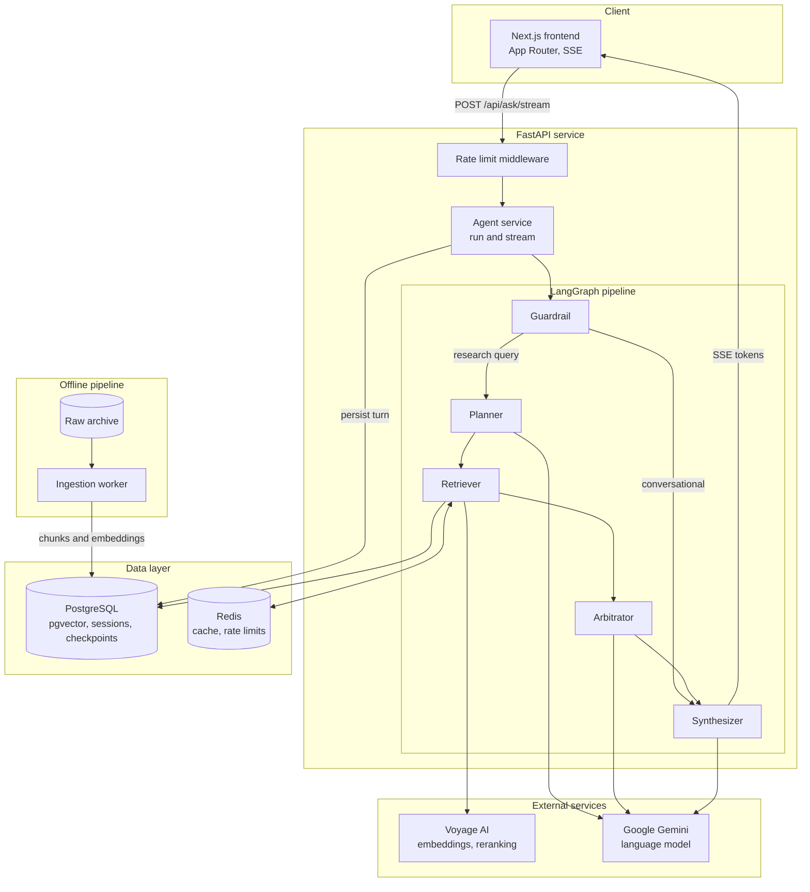
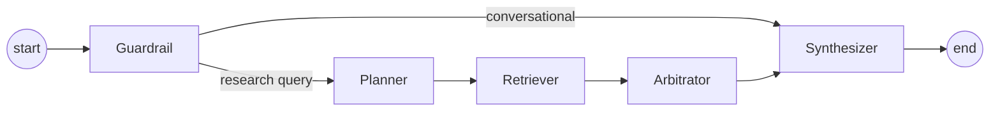
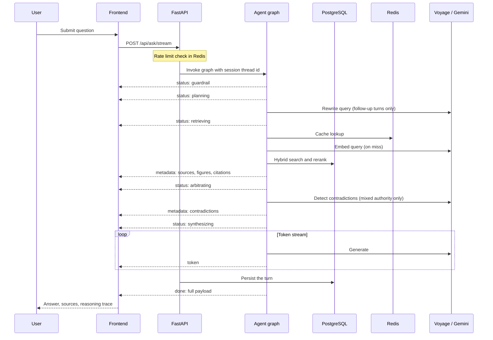

# Architecture

Hermes answers questions over the Ashen Era Archive. It is a retrieval pipeline
with an agent graph on top: a question is classified, rewritten into a
standalone query, answered from evidence retrieved by hybrid search, and
checked for contradictions before an answer is streamed back.

## 1. System overview



## 2. Agent pipeline



The graph is defined in `src/backend/agents/graphs/workflow.py` and compiled
once per process with a PostgreSQL checkpointer, so conversation state survives
across turns and restarts. If the checkpointer cannot be created the graph
falls back to an in-memory saver.

### Guardrail

`agents/nodes/guardrail.py`. Regex-only intent classification, no model call.
Greetings, pleasantries and meta-questions set `is_conversational`, which routes
the request straight to the synthesizer and skips planning, retrieval and
arbitration.

### Planner

`agents/nodes/planner.py`. Rewrites the latest question into a standalone
retrieval query by resolving pronouns against the last few dialogue turns plus
the rolling session summary. Outputs `rewritten_query` and one or two
`search_terms`. On the first turn there is no history to resolve, so the node
passes the query through without calling the model.

### Retriever

`agents/nodes/retriever.py` and `retrieval/`. Embeds the query with Voyage AI,
runs a hybrid search in PostgreSQL, and reranks the candidates with a
cross-encoder. Details in section 3.

### Arbitrator

`agents/nodes/arbitrator.py`. Sorts the retrieved chunks by authority weight and
then relevance. It calls the model only when the evidence actually spans
different authority levels, that is when at least two distinct weights are
present and the lowest is below 0.8. Otherwise no contradiction is possible
between equally authoritative sources and the node returns an empty list.
Detected conflicts are returned as `{topic, sources_disagree}` objects.

### Synthesizer

`agents/nodes/synthesizer.py`. Streams the final answer token by token. It runs
in two modes: a grounded research answer built from the verified evidence, or a
short conversational reply for the greeting fast path. Figures referenced in the
answer are mapped back to the assets served under `/assets`.

## 3. Retrieval

1. The normalized query is hashed and looked up in Redis. A hit returns the
   cached chunks immediately.
2. On a miss the query is embedded with the Voyage model configured in
   `VOYAGE_MODEL`.
3. PostgreSQL runs two searches: pgvector cosine similarity over the chunk
   embeddings and a full-text search over the same chunks. Both result lists are
   fused in SQL with Reciprocal Rank Fusion, producing up to
   `RETRIEVAL_CANDIDATE_LIMIT` candidates.
4. The Voyage cross-encoder reranks those candidates. Anything below
   `RERANK_SCORE_THRESHOLD` is discarded and the top `RERANK_TOP_K` chunks move
   forward.
5. The result is written back to Redis with `REDIS_CACHE_TTL_SECONDS`.

Redis is treated as optional. If it is unavailable the retriever logs a warning
and proceeds without a cache.

## 4. Source authority

Every chunk is tagged at ingestion with its source category and a corresponding
authority weight. The weights are configurable, see
[configuration.md](configuration.md).

| Category | Weight | Meaning |
|---|---|---|
| Codex, image plates | 1.0 | Official reference, treated as canon |
| Wiki | 0.8 | Curated consensus |
| Novel, chronicles | 0.6 | Narrative accounts, subject to perspective |
| Ephemera | 0.4 | Letters, ledgers, ballads, unverified |

The arbitrator uses these weights to order evidence and to decide whether a
contradiction check is worth a model call. The synthesizer is instructed to
uphold the higher-tier source when sources conflict and to report the
disagreement rather than hide it.

Each source in an API response also carries a `trust` field for display. It is
`high` for codex and image sources or any source that reranked above 0.7, and
`medium` otherwise.

## 5. Request lifecycle



Model calls per question:

| Question type | Nodes run | Model calls |
|---|---|---|
| Greeting | Guardrail, Synthesizer | 1 |
| First research question | All five | 1 |
| Follow-up, uniform authority | All five | 2 |
| Follow-up, mixed authority | All five | 3 |

## 6. Frontend

Next.js App Router. `/` redirects to `/chat`, which generates a session id and
replaces the URL with `/chat/<sessionId>`. Loading that URL directly fetches the
session from the backend; a 404 is treated as a new, empty session.

`components/hermes-app.tsx` owns session state and the SSE connection. The
answer card renders Markdown, source cards with trust badges, embedded figures,
and a collapsible trace of what each node did. The sidebar lists past sessions
with relative timestamps and supports delete and new chat.

## 7. Data model

Chunks live in the `document_chunks` table, one row per chunk:

```json
{
  "chunk_id": "codex_vol2_p114_c3",
  "doc_id": "codex_vol2",
  "content": "...",
  "embedding": [0.012, -0.034],
  "metadata_payload": {
    "source_category": "codex",
    "epistemic_weight": 1.0,
    "section_title": "Chapter 4",
    "figure_references": ["plates/codex_vol2_plate7.png"]
  }
}
```

Conversations live in a chat session table: one row per session holding the
ordered question and response turns, an auto-generated title derived from the
first question, and a rolling summary used by the planner. LangGraph
checkpoints are stored in their own tables in the same database, keyed by
session id.

## 8. Ingestion

`src/backend/workers/run_ingest.py` walks `RAW_ARCHIVE_DIR`, parses each
document with Docling (PyMuPDF as fallback), crops figures and tables into
`ASSETS_DIR`, chunks the text semantically, embeds each chunk with Voyage AI,
and writes rows into `document_chunks`. Already-ingested files are skipped
unless `--force` is passed.

```bash
make ingest                                    # everything
make ingest-wiki                               # one folder
python -m src.backend.workers.run_ingest --folder images --limit 20
```

## 9. Operational behaviour

- **Rate limiting.** `REDIS_RATE_LIMIT_REQUESTS` per `REDIS_RATE_LIMIT_WINDOW_SECONDS`
  per client IP, enforced by middleware. Fails open when Redis is down.
- **Caching.** Retrieval results and the session list are cached in Redis and
  invalidated on write. Fails open.
- **Model client reuse.** Chat model instances are cached per temperature so
  nodes do not re-initialize a client on every invocation.
- **Provider fallback.** Gemini is used when `GCP_PROJECT_ID` or a Gemini API
  key is present, otherwise OpenRouter if configured, otherwise a stub model
  that returns a configuration message instead of failing at import time.
- **Persistence.** Sessions and graph checkpoints are in PostgreSQL, so a
  restart does not lose conversation state.

## 10. Tech stack

| Layer | Choice |
|---|---|
| API | FastAPI with SSE streaming |
| Agent orchestration | LangGraph with a PostgreSQL checkpointer |
| Storage and search | PostgreSQL 16 with pgvector, full-text search, RRF |
| Cache and limits | Redis 7 |
| Embeddings and reranking | Voyage AI |
| Language model | Google Gemini, OpenRouter fallback |
| Document parsing | Docling with a PyMuPDF fallback |
| Frontend | Next.js App Router, React, Tailwind CSS |
