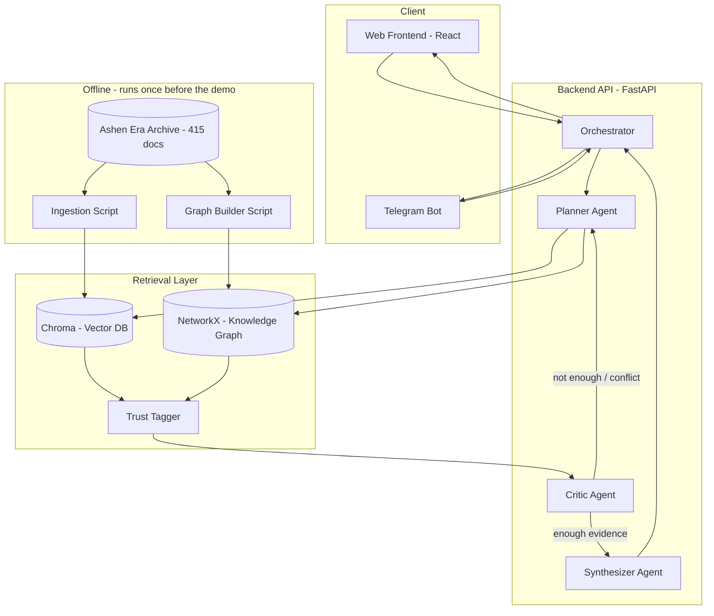
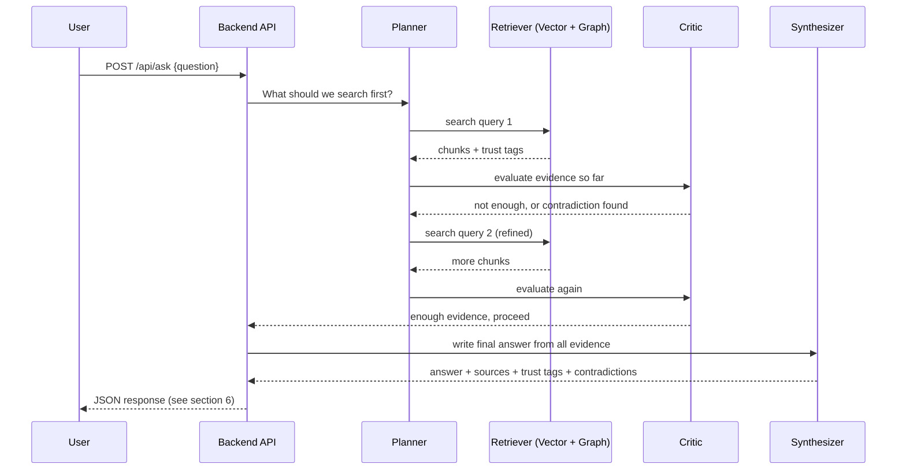

# Technical Architecture — The Archivist

**Sub-track:** 1C — Searching the Way a Human Does
**This file belongs at:** `docs/architecture.md`

---

## 1. Overview

The Archivist answers questions over the Ashen Era Archive by running a loop of three small agents (Planner, Critic, Synthesizer) on top of a retrieval layer (vector search + knowledge graph). It keeps searching until it has enough evidence, and it explicitly flags when sources disagree instead of silently picking one. That trust/contradiction handling is the project's core differentiator — everything else in this doc supports it.

---

## 2. System Diagram



---

## 3. Request Flow (one question, step by step)



Max hops per question: **5** (hard limit, prevents infinite loops and runaway API usage). If the agent hits 5 hops without being confident, it answers with what it has and says so honestly — don't hide uncertainty.

---

## 4. Components

### 4.1 Ingestion Pipeline (offline, run once)
- Reads all 415 documents (PDF, DOCX, markdown, txt, simulated scans)
- Runs OCR on scanned pages (Tesseract)
- Splits documents into chunks (by section/paragraph, ~300-500 words each)
- Tags every chunk with metadata: `source_type` (novel / wiki / codex / ephemera), `trust_tier` (see section 5)
- Generates embeddings for each chunk (Voyage AI `voyage-4-lite`)
- Writes chunks + embeddings + metadata into Chroma

### 4.2 Graph Builder (offline, run once)
- Reads each chunk once, asks an LLM to pull out entities and relationships ("Component Y — affects → Equipment Z")
- Builds a NetworkX graph: nodes = entities, edges = relationships, each edge tagged with its source chunk and trust tier
- Saves the graph to disk (`graph.gpickle`), loaded once when the backend starts

### 4.3 Retrieval Layer (online, called every search round)
- **Vector search:** embed the current search query, find closest chunks in Chroma
- **Graph search:** if the question involves connected entities, walk the graph a few hops to pull in linked facts
- Both return results already carrying their trust tier

### 4.4 Trust & Contradiction Layer
- Every chunk/edge already has a `trust_tier` from ingestion (no separate service — it's metadata attached at ingestion time)
- A small comparison function checks: do any two retrieved chunks make opposite claims about the same fact? (simple LLM prompt: "do these two passages agree or conflict?")
- If conflict found, it's passed to the Critic agent, not resolved silently

### 4.5 Agent Orchestrator
Three agents, each with one job. Plain Python functions, no framework needed:

| Agent | Input | Output |
|---|---|---|
| **Planner** | question + everything found so far | next search query, or "done" |
| **Critic** | all retrieved chunks so far | `enough: true/false`, `contradiction: true/false + details` |
| **Synthesizer** | all retrieved chunks (final set) | final answer text + citations |

The orchestrator is the loop: call Planner → call Retriever → call Critic → repeat or hand off to Synthesizer.

### 4.6 Backend API
FastAPI app exposing the endpoints in section 6. Stateless — each request carries its own question, no session storage needed for the MVP.

### 4.7 Frontend
Next.js (App Router) + Tailwind. Three-panel layout, NotebookLM-style split screen:
- **Left panel — Sources:** the source documents used for the current answer, each shown as a card with a trust badge (green = high, yellow = medium, orange = medium-low, red = low)
- **Center panel — Chat:** question input + scrolling answer history. Shows an amber contradiction banner above any answer where `contradictions` is non-empty
- **Right panel — Reasoning Trace:** the agent's search steps for the current question, in order, updating live as they come in

Calls `/api/ask` only — no Next.js API routes, all data comes from the FastAPI backend. Built first against mock JSON matching the exact schema in section 6.

### 4.8 Telegram Bot
`python-telegram-bot`, long-polling (no public URL needed). Calls the same `/api/ask` endpoint, formats the response as a text message (answer + top 2-3 sources). Same backend, second doorway — no logic duplicated.

### 4.9 Eval Harness
A script that loops through `sample_questions.json`, calls `/api/ask` for each, and logs whether the answer looks correct (simple keyword check or LLM-as-judge). Run this after every meaningful backend change. Output goes to `results/eval_log.json` — this becomes evidence in your report of "what works."

---

## 5. Data Model

### Trust tiers (assign at ingestion time, based on document type)
| Tier | Source type | Meaning |
|---|---|---|
| `high` | Codex data books | Official reference, most reliable |
| `medium` | Wiki articles | Curated, generally reliable |
| `medium-low` | Novels | In-world narrative, can be biased by character POV |
| `low` | Ephemera (letters, ledgers, ballads, trial transcripts) | Personal, gossip, or unverified accounts |

### Chunk schema (stored in Chroma metadata)
```json
{
  "chunk_id": "codex_vol2_p114_c3",
  "text": "...",
  "source_doc": "Codex Vol. 2",
  "page": 114,
  "source_type": "codex",
  "trust_tier": "high"
}
```

### Graph edge schema (stored in NetworkX)
```json
{
  "from": "Component Y",
  "to": "Equipment Z",
  "relation": "affects",
  "source_chunk_id": "codex_vol2_p114_c3",
  "trust_tier": "high"
}
```

---

## 6. API Contract

### `POST /api/ask`
Request:
```json
{ "question": "Which other equipment is affected if component Y fails?" }
```

Response:
```json
{
  "answer": "string - the final written answer",
  "reasoning_steps": [
    { "step": 1, "action": "Searched: 'component Y failure'", "found": "3 relevant chunks" },
    { "step": 2, "action": "Not enough info, searched: 'equipment linked to Y'", "found": "2 relevant chunks" }
  ],
  "sources": [
    { "title": "Codex Vol. 2, p.114", "trust": "high", "snippet": "..." },
    { "title": "Tavern Ballad #7", "trust": "low", "snippet": "..." }
  ],
  "contradictions": [
    { "topic": "Who repaired the artifact", "sources_disagree": ["Codex Vol.2", "Ballad #7"] }
  ]
}
```

### `GET /api/health`
Returns `{ "status": "ok" }` — used to confirm the backend is up before a demo.

This contract is frozen from day one. Frontend mocks it exactly. Backend must return exactly this shape.

---

## 7. Codebase Folder Structure (inside `src/`)

```
src/
├── backend/
│   ├── main.py              # FastAPI app, defines /api/ask, /api/health
│   ├── orchestrator.py       # the loop: Planner -> Retriever -> Critic -> Synthesizer
│   ├── agents/
│   │   ├── planner.py
│   │   ├── critic.py
│   │   └── synthesizer.py
│   ├── retrieval/
│   │   ├── vector_search.py  # Chroma queries
│   │   └── graph_search.py   # NetworkX queries
│   └── trust.py               # trust tier lookup + contradiction check
├── ingestion/
│   ├── ingest.py              # parses corpus, chunks, embeds, loads into Chroma
│   └── build_graph.py         # extracts entities/relations, builds NetworkX graph
├── frontend/                  # Next.js app
├── bot/
│   └── telegram_bot.py
└── eval/
    └── run_eval.py            # runs sample_questions.json against /api/ask
```

---

## 8. Tech Stack

| Layer | Tool | Cost |
|---|---|---|
| Backend | Python + FastAPI | Free |
| Vector DB | Chroma (embedded) | Free |
| Knowledge graph | NetworkX (in-memory) | Free |
| Embeddings | Voyage AI `voyage-4-lite` | Free (200M token allowance) |
| LLM (all 3 agents) | OpenRouter free models (`:free`, currently `minimax/minimax-m2.7:free`) | Free |
| OCR | Tesseract | Free |
| Frontend | Next.js + Tailwind | Free |
| Bot | python-telegram-bot | Free |
| Hosting (optional) | Fly.io free tier | Free |

---

## 9. Non-Functional Notes

- **Rate limits:** free OpenRouter tier is ~50 requests/day per key with no card. Multi-agent means 3+ calls per search round. Use exponential backoff (1s, 2s, 4s...) on every LLM/API call, and have each team member use their own key during development.
- **Cost/latency control:** hard cap of 5 search hops per question. If hit, answer with what's available and say so.
- **Secrets:** all API keys in `.env`, `.env` listed in `.gitignore`. Never hard-code keys in source files — judges read full commit history, including old commits.
- **Corpus is read-only:** never modify files in the provided corpus folder; ingestion scripts only read from it.

---

## 10. Deployment

For the demo, either:
- Run everything locally and record the screen (simplest, most reliable), or
- Deploy backend + frontend to Fly.io free tier for a live public link

Local is safer for the recording — no risk of a free-tier cold start or outage happening mid-take.
