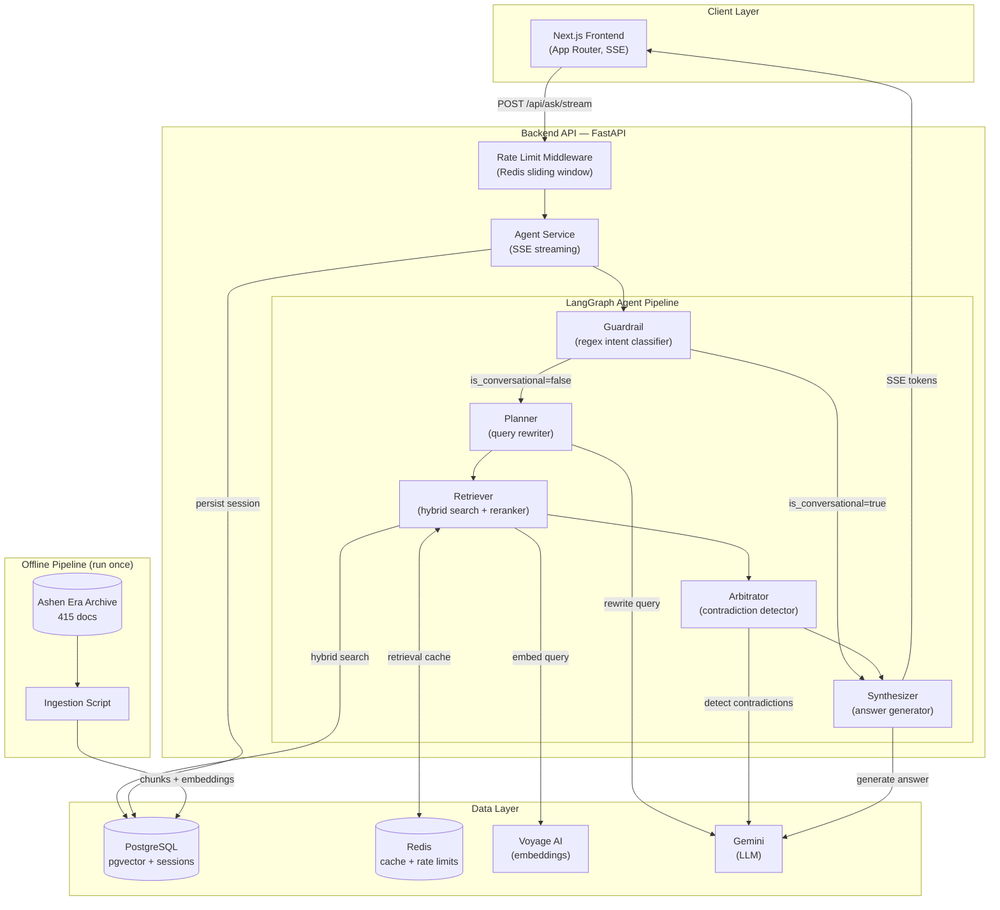
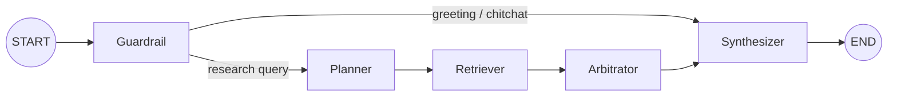
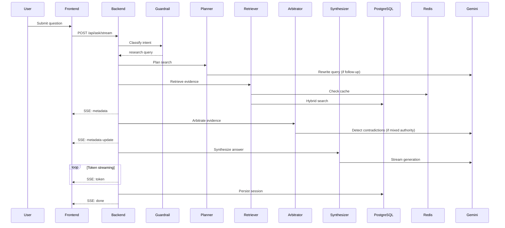

# Architecture Diagrams

Source of truth is `docs/architecture.md` sections 2-3. These are the same
diagrams kept here as standalone files per the required submission structure.

## System Diagram

## Agent Graph (Conditional Routing)

## Request Flow (Research Query)

