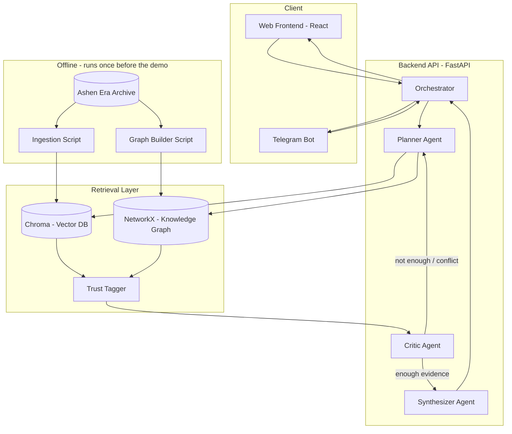
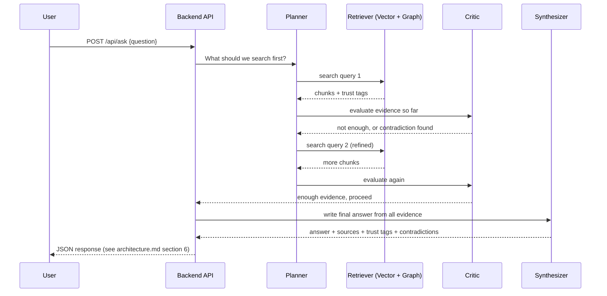

# Architecture Diagrams

Source of truth is `docs/architecture.md` sections 2-3 — these are the same
two diagrams, kept here as standalone files per the required submission
structure (`CLAUDE.md`, challenge doc section 5.2). Update both places
together if the design changes.

## System diagram

## Request flow (one question, step by step)

Max hops per question: **5** (hard limit, prevents infinite loops and
runaway API usage). If the agent hits 5 hops without being confident, it
answers with what it has and says so honestly — see `orchestrator.py`'s
`UNCERTAINTY_NOTE`.
