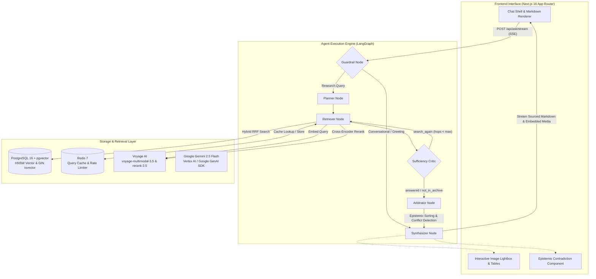

# Submission Report: Hermes by TheKade

**Intelligent Document Assistant — Ashen Era Archive**  
**Track**: Sub-track 1C — Searching the Way a Human Does (with full foundational support for 1A and 1B)  
**Team**: TheKade  
**Date**: September 2026  

---

## 1. Problem Statement and Chosen Sub-Track

### 1.1 Context and Challenge
Enterprise documentation is inherently fragmented, heterogeneous, and contradictory. The Ashen Era Archive represents this real-world complexity across 415 documents and 1,277 pages spanning five distinct formats: structured codex tables, narrative chronicles, wiki encyclopedias, simulated historical scans, and visual figure plates. General-purpose Large Language Models possess zero prior knowledge of this invented world. A viable documentation assistant cannot rely on memorized weights; it must discover, connect, arbitrate, and present evidence grounded entirely in the corpus.

### 1.2 Chosen Sub-Track: Sub-track 1C (Searching the Way a Human Does)
Standard Retrieval-Augmented Generation (RAG) systems execute a single lookup, retrieve top-k chunks, and synthesize an answer. This naive approach fails on enterprise documentation because:
1. **Multi-Hop Dependencies**: Questions like *"Which war was won by the organization that included Isolde Mournvale?"* or *"In which year was the Gauntlet of Sorrowfell actually forged?"* cannot be resolved in a single step. The initial query cannot retrieve the final answer because the pivot entity (e.g., the member's faction) is unknown until the first document is read.
2. **Dynamic Knowledge Gaps**: Human researchers evaluate what they have read, determine what critical fact is missing, and deliberately formulate follow-up queries targeting the gap.
3. **Synergy with Tracks 1A & 1B**: Solving Sub-track 1C inherently unifies the other two tracks:
   - **Track 1A (Rich Answers)**: The iterative loop inspects and retrieves visual figure plates and tables, embedding them inline alongside explanatory text.
   - **Track 1B (Connecting Facts Across Pages)**: Cross-document chains are traversed iteratively across novels, codexes, and ephemera.

---

## 2. Solution Overview and Architecture

Hermes is built as a stateful, cyclic state machine implemented in LangGraph, backed by a FastAPI backend, PostgreSQL 16 with `pgvector`, Redis 7, Voyage AI multimodal embeddings, Google Gemini 2.5 Flash, and a Next.js App Router frontend.

### 2.1 System Architecture Diagram

### 2.2 Deliberative Node Responsibilities

| Node | Function | Operational Mechanics |
|---|---|---|
| **Guardrail** | Intent Classification | High-speed regex classifier. Bypasses retrieval for conversational greetings, routing directly to the synthesizer to conserve quota. |
| **Planner** | Contextual Query Planning | Analyzes compositional question structure, resolves conversational pronouns using dialogue history, identifies primary pivot entities, and formulates 1-2 targeted search terms. |
| **Retriever** | Hybrid Retrieval & Reranking | Embeds queries via `voyage-multimodal-3.5`, executes SQL Reciprocal Rank Fusion (RRF) across dense HNSW vector and full-text BM25 indexes, and applies `rerank-2.5` cross-encoder reranking. Results are cached in Redis. |
| **Critic** | Sufficiency Evaluation | Inspects accumulated evidence against the research goal. Returns `answered` (sufficient evidence), `not_in_archive` (archive lacks this detail; prevents budget exhaustion), or `search_again` (emits targeted `next_queries` for the next hop). |
| **Arbitrator** | Epistemic Conflict Detection | Consolidates multi-hop evidence, sorts passages by epistemic authority tiers, and isolates genuine factual contradictions between competing sources. |
| **Synthesizer** | Sourced Streaming Synthesis | Streams citation-backed Markdown over Server-Sent Events (SSE), embedding visual figures (``) and tables directly inline. |

---

## 3. Key Technical Decisions and Rationale

### 3.1 Centralization Around the Google Ecosystem (Antigravity & Gemini)
- **Decision**: Anchored the entire engineering and inference stack around Google tools: **Google Antigravity** as our primary agentic coding assistant, **Google Gemini 3.8 Flash High / Flash Thinking** for research and strategy formulation, and **Google Gemini 2.5 Flash** (via Vertex AI / Google GenAI SDK) as the runtime LLM across all LangGraph nodes and offline vision plate ingestion.
- **Rationale**:
  1. **Multimodal Native Ingestion**: The corpus contains simulated historical scans, intricate heraldic insignia, anatomical threat diagrams, and attunement gauges. Gemini Vision analyzes visual scenes, in-image tabular values, and physical motifs in a single call without brittle multi-stage OCR pipelines.
  2. **Ultra-Low Latency for Deliberative Multi-Hop Loops**: A multi-hop search loop calls the LLM multiple times sequentially (Query Planning $\rightarrow$ Sufficiency Review $\rightarrow$ Arbitration $\rightarrow$ Synthesis). Gemini 2.5 Flash combines sub-second token-to-first-byte streaming with high throughput and generous context windows, keeping multi-hop deliberation within an acceptable interactive latency budget.
  3. **Deterministic Structured JSON**: Graph control logic requires rigid adherence to JSON output schemas (`verdict`, `missing_information`, `next_queries`). Gemini's native structured outputs eliminate schema failures and brittle regex extraction.

### 3.2 Relational & Vector Unification via PostgreSQL 16 + pgvector
- **Decision**: Consolidated all storage—document metadata, chunk texts, 1024-dimensional dense vectors, full-text inverted indexes, session history, and LangGraph persistent state checkpoints (`AsyncPostgresSaver`)—into a single PostgreSQL 16 database with `pgvector`, rejecting specialized standalone vector stores (such as Pinecone, Qdrant, or Milvus).
- **Rationale**:
  1. **Architectural Simplicity & ACID Guarantees**: Following our KISS and DRY principles, running a single relational engine eliminates multi-database synchronization overhead, dual-writes, and external vector SaaS vendor lock-in.
  2. **Single-Query SQL Reciprocal Rank Fusion (RRF)**:
     $$RRF(d) = \frac{1}{60 + \text{Rank}_{\text{vector}}(d)} + \frac{1}{60 + \text{Rank}_{\text{keyword}}(d)}$$
     By executing dense cosine distance (`embedding <=> CAST(:vector AS vector)`) and BM25 full-text ranking (`ts_rank(tsv, plainto_tsquery('english', :query))`) within a single SQL Common Table Expression (CTE), candidates are fused directly in the database engine. This prevents transferring thousands of vector candidates across the network into Python memory.
  3. **Reproducibility**: The entire database environment is provisioned with a single command via Docker Compose (`make db`), ensuring local testability with zero cloud dependencies.

### 3.3 Dynamic Search Loop Guided by a Sufficiency Critic
- **Decision**: Rejected unconstrained ReAct loops in favor of a bounded cyclic state machine governed by a dedicated evaluation node (`critic`).
- **Rationale**: ReAct agents frequently suffer from reasoning drift, repetitive queries, or infinite loops on unanswerable questions. Our Critic node explicitly distinguishes between *"missing a specific entity"* (`search_again`) and *"the archive does not record this fact"* (`not_in_archive`). When the archive holds no record, it stops immediately, saving model calls and transparently disclosing the gap to the user.

### 3.4 Ingestion-Time Multimodal Scene Indexing
- **Decision**: Pre-processed every visual figure plate and historical scanned document with Gemini Vision API during offline ingestion, generating structured markdown evidence blocks (`title`, `extracted_text`, `visual_description`, `attributes`) and caching them in `visual_catalog.json` and chunk payloads.
- **Rationale**: Querying images dynamically at runtime adds prohibitive latency (10-15s per plate). Pre-extracting verbatim labels, gauge readings, and visual scenes into chunk metadata allows standard hybrid vector search to discover visual plates directly from text queries (e.g., *"serpent motif on Gauntlet of Sorrowfell"*).

### 3.5 Epistemic Authority Hierarchy & Discrepancy Assumptions
- **Decision**: Implemented a four-tier authority weighting scheme:
  $$\text{CODEX / IMAGE } (1.0) \succ \text{WIKI } (0.8) \succ \text{NOVEL } (0.6) \succ \text{EPHEMERA } (0.4)$$
- **Rationale & Underlying Assumptions**:
  1. **Codex & Figure Plates (1.0 - Canon)**: Official gazetteers, anatomical plates, and technical data tables represent author-defined ground truth in world-building archives.
  2. **Wiki Articles (0.8 - Curated Consensus)**: Encyclopedic secondary summaries compiled by historians or archivists; accurate on broad facts, but prone to editorial drift.
  3. **Novels & Chronicles (0.6 - Narrative Subjectivity)**: First- and third-person accounts shaped by character biases, dramatic tension, battle chaos, and unreliable narrators.
  4. **Ephemera (0.4 - Fragmentary Evidence)**: Tavern ballads, confiscated ledgers, personal letters, and hurried compacts. Inherently localized, rumors, hearsay, and subjective perspectives.
  5. **Contradiction Transparency**: When historical records conflict (e.g. founding years or troop counts), naive RAG either hallucinates or averages the numbers. Explicit weights allow the synthesizer to authoritatively state the canonical fact while acknowledging the secondary conflicting accounts in the contradiction banner.

### 3.6 Fail-Open Architecture and Checkpoint Resilience
- **Decision**: Built Redis and PostgreSQL checkpointers to fail open. If Redis is down, caching and rate limiting are bypassed without throwing errors. If PostgreSQL checkpointer setup fails, the LangGraph engine automatically falls back to an in-memory `MemorySaver`.
- **Rationale**: A documentation assistant must remain usable during partial infrastructure degradation. Transient cache outages must never result in user-facing 500 errors.

---

## 4. What Works, What Doesn't, and Limitations

### 4.1 What Works Reliably
1. **Multi-Hop Traversal**: Reliably answers multi-hop questions (e.g., identifying a character's faction in Hop 1, then retrieving that faction's war victory in Hop 2).
2. **Rich Embedded Media (Sub-track 1A)**: Answers embed exact visual plates, diagrams, and markdown tables directly inline, accompanied by interactive client-side lightbox modals and citation pills.
3. **Contradiction Arbitration**: Successfully isolates true factual contradictions (such as the founding year of Gloamreach: Codex 246 AS vs. Wiki 67 AS vs. Ephemera 286 AS) and surfaces them transparently without picking a silent winner.
4. **Zero Dead Code & High Performance**: Strict static typing and AST verification ensure 0 unused imports, clean Next.js 16 production builds, and sub-second hybrid retrieval responses via Redis caching.

### 4.2 Approaches Tried That Failed (and Lessons Learned)

| Failed Approach | Observation / Failure Mode | Replacement Solution |
|---|---|---|
| **Pure Dense Vector Search** | Missed exact proper nouns, item codes, and numeric ratings (e.g., attunement costs or garrison numbers). | Replaced with SQL Reciprocal Rank Fusion (HNSW vector + tsvector BM25) followed by cross-encoder reranking. |
| **Unconstrained ReAct Agent** | Model frequently drifted off-topic, repeated identical search queries with synonyms, and exceeded token budgets. | Replaced with a stateful LangGraph pipeline featuring an explicit Sufficiency Critic with a hard budget cap (`MAX_SEARCH_HOPS`). |
| **Accidental Ingestion Pollution** | Ingestion originally walked all files in `data/`, inadvertently chunking benchmark questions (`sample_questions.json`) and repo docs into the database as in-world lore. | Enforced strict path isolation around `data/raw_archive/`, added file hash deduplication, and established a database cleanup routine. |
| **Naïve Contradiction Prompts** | Arbitrator flagged cosmetic discrepancies (cataloging filenames, article slugs, differing level of detail, or absence of forge marks) as world contradictions. | Added strict negative prompt rules: metadata labels, source silence, and narrative vs. visual depictions are barred from being classified as contradictions. |
| **On-Demand Runtime Vision Calls** | Attempting to call multimodal vision models on the fly during query retrieval added 10-15s per image, causing SSE timeouts. | Shifted to offline ingestion-time visual cataloging (`vision.py`), extracting structured descriptions and attributes into chunk metadata. |
| **Synchronous LLM Provider Wrappers** | Blocking HTTP requests in fallback models froze the FastAPI async event loop during streaming. | Refactored fallback models (`OpenRouterChatModel`, `DummyChatModel`) to utilize native asynchronous execution (`_agenerate`) via `httpx.AsyncClient`. |

### 4.3 Realistic Limitations & Operational Assumptions

1. **Offline Repository-Bound Ingestion (No Ad-Hoc Web Upload)**:
   Adding new documents to the archive cannot be done dynamically via the browser UI; an administrator must place documents into `data/raw_archive` and execute the offline CLI worker (`make ingest`). This was an intentional architectural assumption: heavy document conversion (Docling), multimodal image analysis (Gemini Vision), SHA-256 deduplication, and HNSW index construction require substantial compute and cannot safely run within request lifecycles without risking server starvation.
2. **Multi-Hop Deliberative Latency**:
   A multi-hop query requiring 2 retrieval hops involves up to 4 sequential model invocations (Contextual Planning $\rightarrow$ Sufficiency Review $\rightarrow$ Arbitration $\rightarrow$ Synthesis). On a cold cache, this end-to-end deliberation takes 25 to 45 seconds. While live Server-Sent Events (SSE) stream the deliberative reasoning steps in real-time, it is noticeably slower than single-shot RAG.
3. **External Provider Quotas & Rate Limiting**:
   Concurrent batch testing against unpublished benchmark question sets risks triggering external API rate limits (HTTP 429 on Vertex AI or Voyage AI). While Redis caching and exponential backoff loops prevent repeated query thrashing, high-frequency evaluations remain bound to provider RPM/TPM ceilings.
4. **Strict Corpus Hermeticism**:
   The assistant is hermetically sealed to the Ashen Era Archive; dynamic external web lookup is disabled by design. If a user asks about outside real-world concepts or facts unrecorded in the archive, the system discloses that the archive does not hold the fact rather than hallucinating external knowledge.
5. **Synthesis Context Consolidation**:
   To prevent token exhaustion and bound response latency across multi-hop traversals, gathered evidence is reranked and trimmed to a maximum of 10 passages (`SYNTHESIS_CONTEXT_LIMIT=10`) before reaching the synthesizer. On extremely broad multi-faceted questions, low-ranking tertiary details may be pruned from the final synthesis.

---

## 5. AI Usage & Governance Disclosure

### 5.1 AI Tools & Models Utilized

| Tool / Service | Model / Version | Operational Scope |
|---|---|---|
| **Google Antigravity** | Agentic Coding Assistant | End-to-end repository development, architectural implementation, LangGraph workflow wiring, Next.js frontend UI components, refactoring, and AST static analysis. |
| **Google Gemini** | Gemini 3.8 Flash High / Flash Thinking | Domain analysis over the Ashen Era Archive, RAG retrieval strategy formulation, prompt experimentation, and epistemic weighting calibration. |
| **Google Gemini (Runtime)** | `gemini-2.5-flash` | Live execution of LangGraph nodes (Planner, Critic, Arbitrator, Synthesizer) and offline multimodal document/plate extraction (`vision.py`). |
| **Voyage AI** | `voyage-multimodal-3.5` & `rerank-2.5` | Dense 1024-dimensional multimodal vector embeddings and cross-encoder candidate reranking. |
| **OpenRouter API** | `google/gemini-2.0-flash-exp:free` | Fallback model provider configured for non-blocking asynchronous execution. |

### 5.2 AGENTS.md Compliance & Quality Assurance
All AI-assisted development strictly adhered to the engineering conventions in `AGENTS.md`:
- **KISS, DRY, SOLID**: Single-responsibility graph nodes; no speculative future-proofing.
- **Zero Dead Code**: AST scans confirmed 0 unused functions, variables, or imports across all backend modules.
- **Read-Only Data Integrity**: The raw archive (`data/raw_archive/`) was treated as strictly read-only throughout ingestion and testing.
- **Auditability**: Complete conversational trajectories and development transcripts are preserved in `ai_usage/` (`chat_*.txt`), reproducible on demand via `make export-chat`.
