# User Flows — The Archivist (Hermes)

End-to-end interaction paths through the system, from user action to final rendered result.

---

## 1. New Session Flow

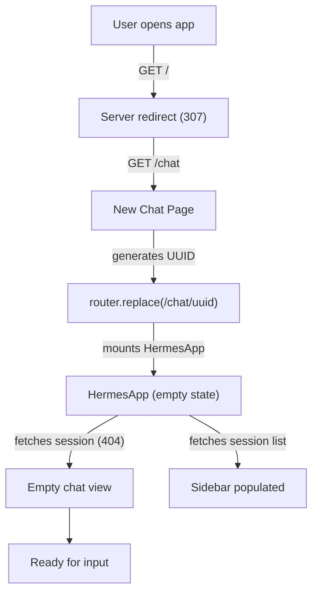

**What happens:**
1. User navigates to `http://localhost:3000/`
2. Server-side redirect sends them to `/chat`
3. `HermesApp` mounts without an `initialSessionId`, generates a UUID
4. `router.replace` updates the URL to `/chat/<new-uuid>` (no history entry)
5. Backend returns 404 for the new session ID (expected — no turns yet)
6. User sees an empty chat with suggested queries

---

## 2. Ask a Question Flow

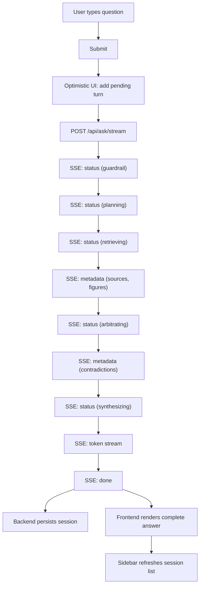

**What the user sees in real-time:**
1. Status indicator cycles through: "Validating input..." → "Formulating search plan..." → "Searching archive..." → "Arbitrating claims..." → "Synthesizing answer..."
2. Source cards appear when metadata arrives (before the answer)
3. Answer text streams token-by-token
4. Reasoning trace populates with each node's findings

---

## 3. Conversational Greeting Flow (Fast Path)

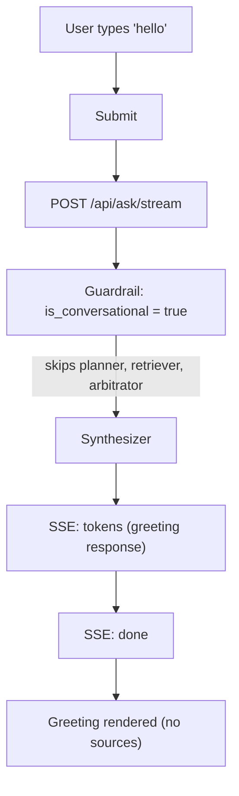

**Key difference from research flow:**
- Only 2 nodes execute (guardrail + synthesizer)
- No embedding, no database query, no Redis lookup
- Single LLM call for the greeting response
- No source cards or reasoning trace displayed

---

## 4. Load Existing Session Flow

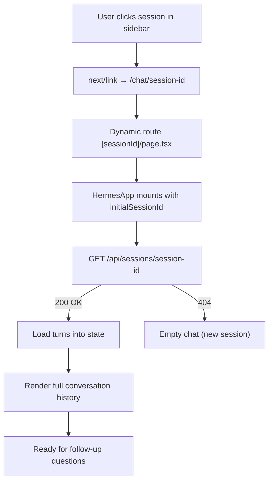

**What happens:**
1. Sidebar items are `<Link>` elements → client-side navigation (no full reload)
2. Next.js extracts `sessionId` from URL params, passes to `HermesApp` as prop
3. Component fetches session details from backend
4. All previous turns render immediately (not streamed — already persisted)
5. User can ask follow-up questions that resolve pronouns against history

---

## 5. Follow-Up Question Flow (Pronoun Resolution)

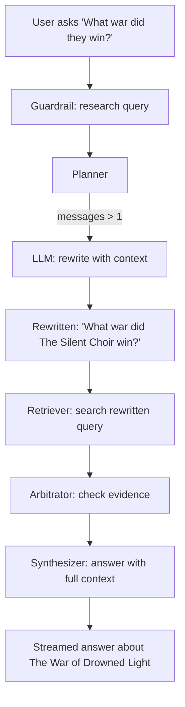

**Key behaviour:**
- Planner sees `messages > 1` and invokes the LLM to resolve "they" → "The Silent Choir" from prior turns
- Search queries use the rewritten standalone form
- This costs an extra LLM call (planner) compared to a first-turn question

---

## 6. Contradiction Detection Flow

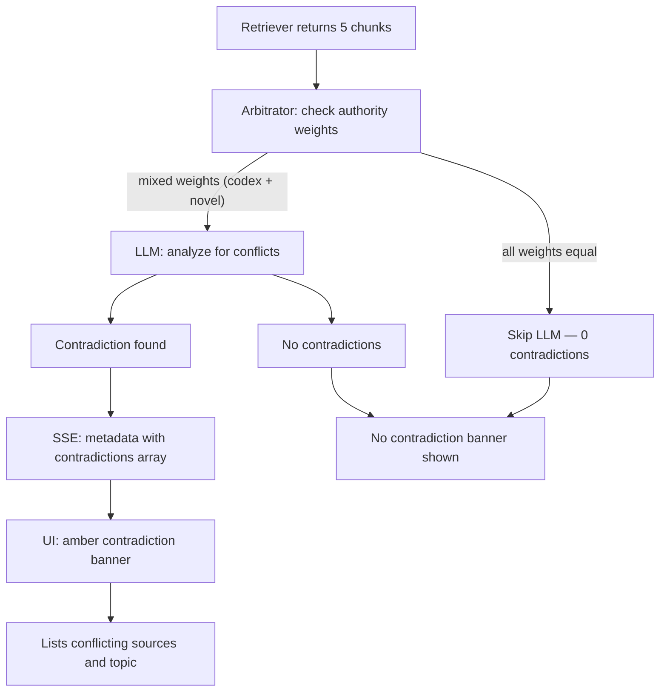

**What triggers an LLM call:**
- At least 2 distinct `epistemic_weight` values in the retrieved chunks
- AND the minimum weight is below 0.8 (meaning a non-wiki/non-codex source is present)

---

## 7. Session Management Flows

### 7a. New Chat

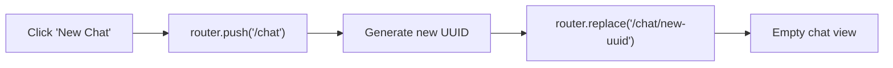

### 7b. Delete Session

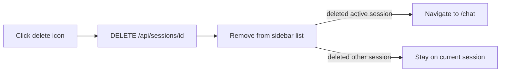

### 7c. Direct URL Access

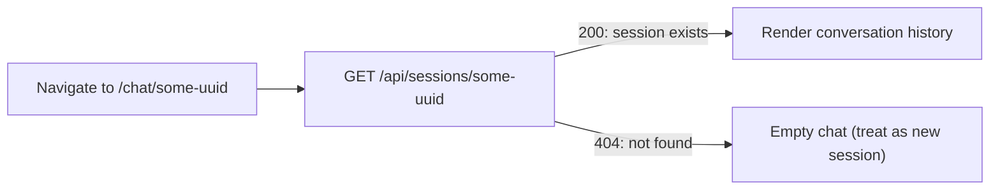

---

## 8. Retrieval Cache Flow

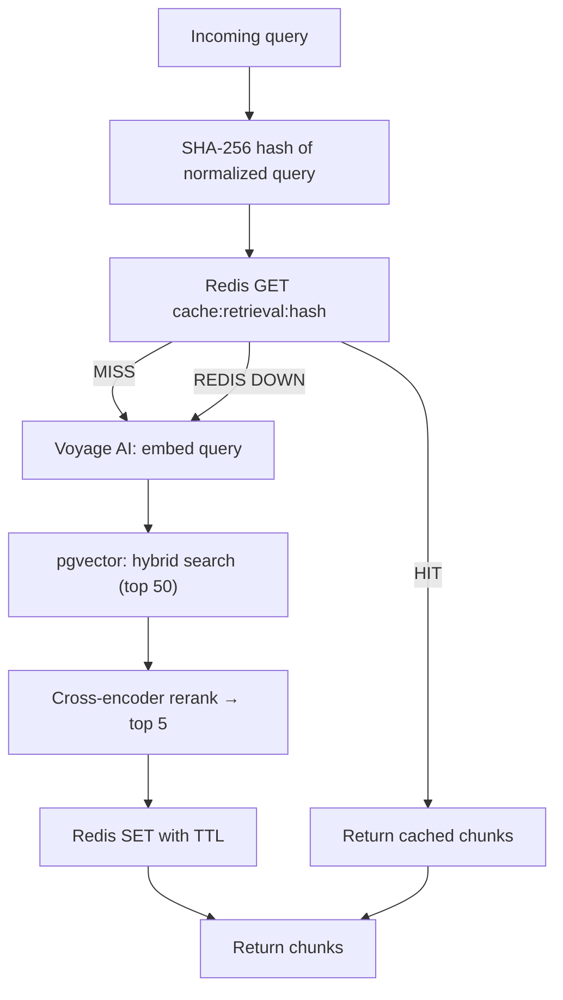

---

## 9. Rate Limiting Flow

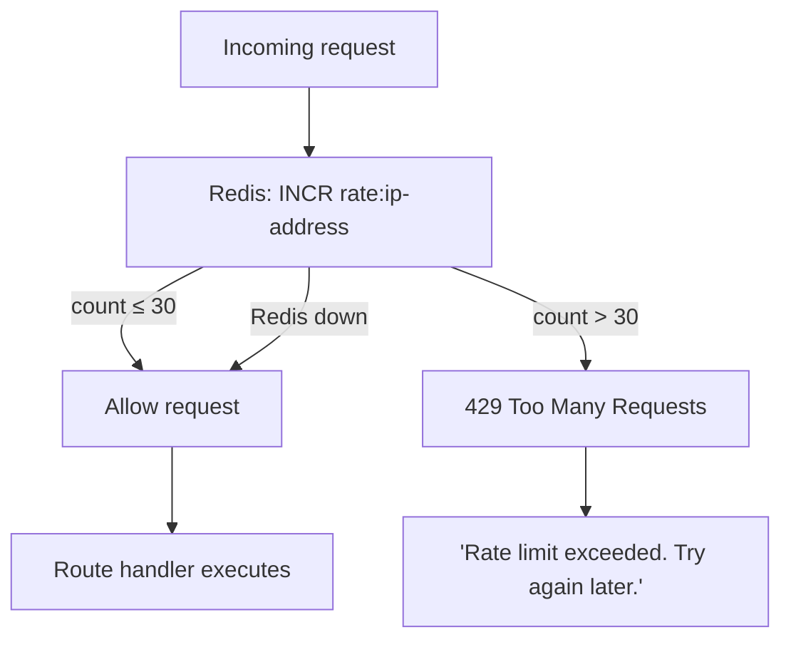

- Window: 60 seconds (sliding)
- Limit: 30 requests per IP
- Fail-open: if Redis is unavailable, all requests are allowed
